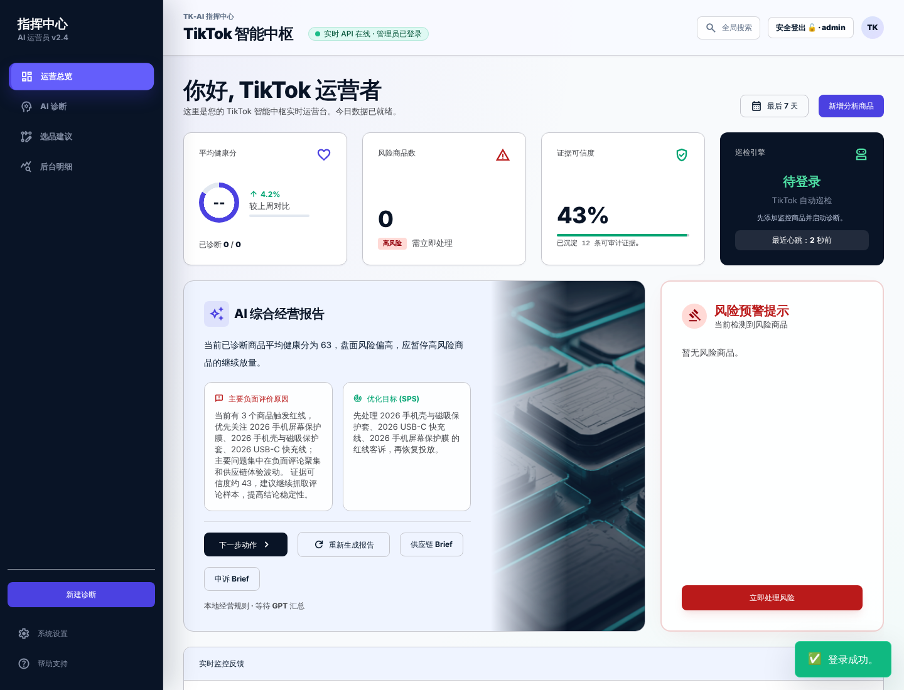
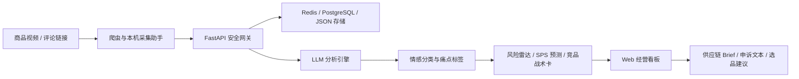

# TK-AI 跨境电商舆情诊断与选品决策中枢



> 面向 TikTok Shop / 跨境电商卖家的 AI 舆情分析与供应链优化系统。项目将商品评论抓取、LLM 情感分类、风险雷达、供应商改良建议和经营 Brief 生成串成一个可部署的 SaaS 工作台，帮助运营团队从非结构化评论中快速定位质量缺陷和选品机会。

[](https://www.python.org/)
[](https://fastapi.tiangolo.com/)
[](https://redis.io/)
[](https://platform.openai.com/)
[](https://www.docker.com/)

## 用户与痛点

跨境电商卖家每天会面对大量 TikTok / YouTube / 店铺评论、达人测评和售后反馈。这些文本往往是非结构化、跨语言、分散在不同平台里的，人工复盘会遇到几个典型问题：

- 无法快速判断负面评论到底来自质量、尺码、包装、物流还是预期管理问题。
- 商品出现差评后，运营、客服和供应链团队之间缺少统一证据链，容易只看到“评分下降”，看不到“为什么下降”。
- 新品选品和供应商改良依赖经验判断，难以把真实买家反馈转化为可执行的打样、改款和投放建议。
- 当商品池扩大后，人工巡检无法持续覆盖所有链接，风险商品容易在 24 小时内继续扩散。

TK-AI 的目标是把“评论噪音”转化为“供应链行动清单”：先抓取评论，再用 AI 进行多维标签与情感分析，最后输出可视化风险看板、SPS 修复预测和面向供应商的精益改善 Brief。

## 核心功能架构

### 1. Data Ingestion

- 支持 TikTok / YouTube 商品视频链接评论采集，并保留多平台扩展入口。
- 针对受平台风控限制的场景，提供本机采集助手与平台登录态管理，避免云服务器直接撞风控。
- 抓取结果结构化为商品级诊断数据，包括评论样本、情感比例、关键词痛点、来源链接和雷达状态。
- Redis / PostgreSQL / 本地 JSON 多级存储适配，便于从本地开发平滑迁移到云端部署。

### 2. AI Analytics Engine

- 通过 OpenAI / OpenRouter 兼容接口调用 LLM，对非结构化评论做情感分类与业务标签抽取。
- 负面标签覆盖质量问题、尺码问题、物流问题、包装破损、功能不符、预期落差等电商常见痛点。
- 内置规则兜底逻辑：当模型 API 不可用时，仍可基于关键词和情感规则生成基础诊断，保证系统可演示、可恢复。
- 支持竞品横向 PK、Market Gap Radar、Evidence Audit、Battlecard 等后台深度指标，前台默认收敛为 AI 综合经营报告。

### 3. Business Insights Dashboard

- Web 指挥中心展示健康分、风险商品、证据可信度、AI 综合经营报告和建议动作。
- 风险雷达自动识别负面舆情异常，支持一键进入高风险商品处置。
- SPS 绩效半衰预测器用于模拟“撤回差评 / 新增好评”对店铺评分修复的影响。
- 自动生成供应链改良 Brief、申诉抗辩文本和选品决策建议，帮助运营团队把评论反馈传递给供应商和客服团队。
- 内置账号密码登录、Session Token、接口鉴权、邀请码注册、管理员审计和数据备份恢复。

## 系统架构



## 技术栈

| 模块 | 技术 |
| --- | --- |
| 后端 API | Python, FastAPI, Pydantic, Uvicorn |
| 前端界面 | HTML, Tailwind CSS, Chart.js, 原生 JavaScript |
| AI 能力 | OpenAI / OpenRouter Compatible API, Prompt Engineering, JSON 结构化输出 |
| 数据采集 | Playwright, Requests, 多平台爬虫脚本, 本机采集助手 |
| 缓存与状态 | Redis |
| 持久化 | PostgreSQL 可选，JSON 文件兜底 |
| 安全 | Bearer Token 鉴权, 密码哈希, 邀请码注册, 登录失败限流, 管理员审计 |
| 部署 | Docker Compose, Caddy, Cloudflare Pages, GitHub |

## 项目亮点

- **从评论到行动闭环**：不是只做情感柱状图，而是把负面评论转成供应商改良建议、申诉文案和选品策略。
- **适合真实跨境业务**：围绕 TikTok Shop 商品测评、差评原因、物流/质量问题和 SPS 修复场景设计。
- **SaaS 化安全能力**：内置登录、邀请码、管理员权限、接口鉴权和审计日志，具备放给多人使用的基础。
- **云端可部署**：已适配 Docker Compose + Caddy + Redis，并支持 Cloudflare Pages 静态前端发布。
- **可解释的 AI 报告**：前台只展示经营结论，复杂指标折叠到后台明细，降低运营人员理解成本。

## 快速启动

### 1. 安装依赖

```bash
python -m venv .venv
source .venv/bin/activate
pip install -r requirements.txt
python -m playwright install chromium
```

### 2. 配置环境变量

```bash
cp .env.example .env
```

至少需要配置：

```env
OPERATOR_USERNAME=admin
OPERATOR_PASSWORD=change-me
OPERATOR_TOKEN=your-long-random-token
OPENAI_BASE_URL=https://api.openai.com/v1
OPENAI_MODEL_NAME=gpt-5.5
OPENAI_API_KEY=your-api-key
REDIS_URL=redis://localhost:6379/0
```

### 3. 本地运行

```bash
uvicorn server:app --host 0.0.0.0 --port 8000 --reload
```

打开：

```text
http://127.0.0.1:8000
```

### 4. Docker 部署

```bash
docker compose up -d --build
```

## 目录结构

```text
.
├── index.html                         # Web 指挥中心入口
├── TK_AI_ECommerce_Dashboard.html      # 静态 Pages 同步副本
├── server.py                          # FastAPI 网关、鉴权、数据 API
├── ai_diagnose.py                     # LLM 评论诊断脚本
├── crawler_engine.py                  # 爬虫调度与平台识别
├── scrape_tiktok_comments.py          # TikTok 评论采集
├── scrape_youtube_comments.py         # YouTube 评论采集
├── scrape_multi_source_comments.py    # 多平台采集入口
├── tools/                             # 本机采集与平台登录助手
├── scripts/                           # 云端验证、部署、样本数据脚本
├── docs/assets/                       # README 展示图与文档资产
├── docker-compose.yml                 # API + Redis + Caddy
└── requirements.txt
```

## API 概览

| 接口 | 说明 |
| --- | --- |
| `POST /api/login` | 账号密码登录，返回 Session Token |
| `GET /api/products` | 获取商品诊断数据 |
| `POST /api/add-product` | 注册新的监控商品 |
| `POST /api/run-pipeline` | 抓取链接评论并运行 AI 诊断 |
| `POST /api/run-tiktok-autopilot` | 执行 TikTok 商品自动巡检 |
| `POST /api/executive-report` | 生成 AI 综合经营报告 |
| `POST /api/generate-executive-brief` | 生成选品 / 供应链 / 申诉 Brief |
| `GET /api/admin/audit-logs` | 管理员操作审计 |

除 `/api/login` 和 `/api/health` 外，业务接口均需要：

```http
Authorization: Bearer <session-token>
```

## 适合写进简历的表述

> 独立设计并实现一个面向 TikTok Shop 跨境卖家的 AI 舆情诊断与选品决策系统，基于 FastAPI + Redis + Playwright + LLM 构建评论抓取、情感分类、风险雷达、SPS 修复预测和供应链 Brief 生成链路；前端采用 Tailwind + Chart.js 实现 SaaS 化经营看板，并补齐账号密码登录、邀请码注册、Token 鉴权、管理员审计和 Docker 云端部署能力。

## 免责声明

本项目用于跨境电商评论分析、运营复盘和供应链改良研究。采集第三方平台数据时应遵守平台服务条款、隐私政策和当地法律法规。
